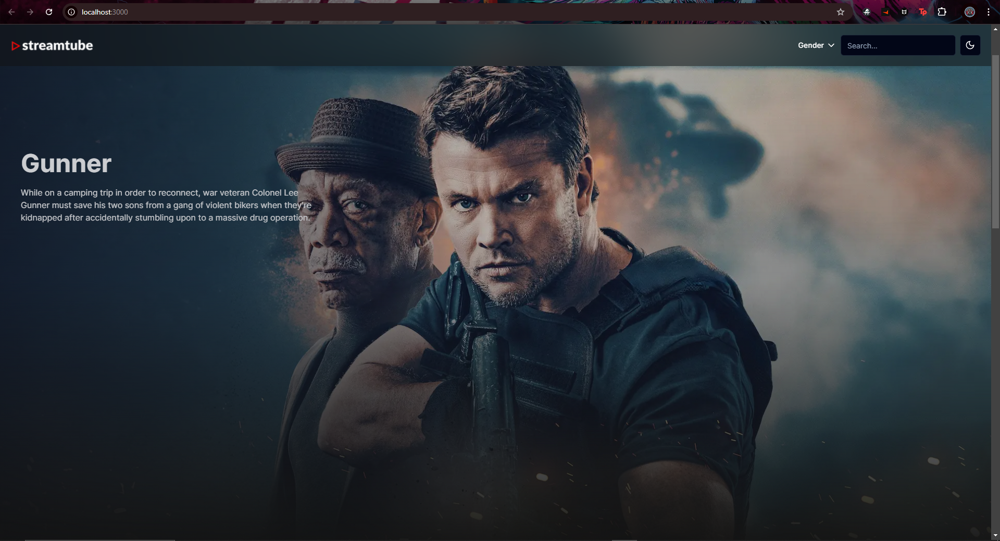
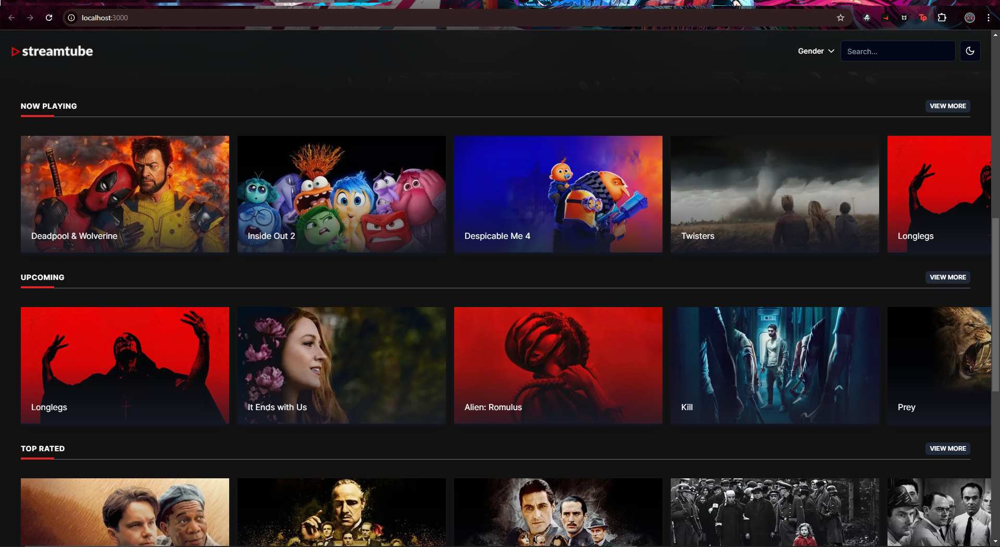
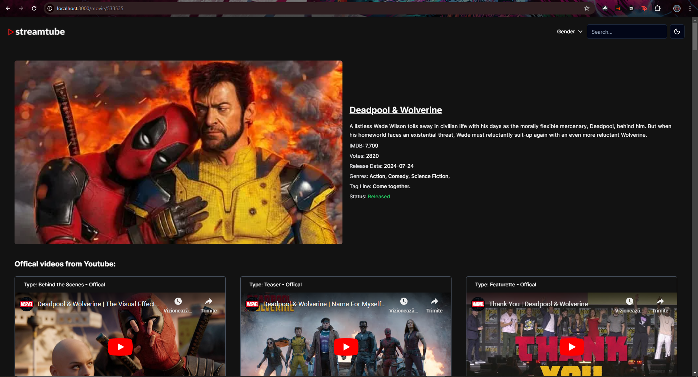

# StreamTube

StreamTube is a sleek and modern video streaming platform that showcases the latest movies using the IMDb API. It provides detailed descriptions, reviews, and official trailers for each movie, offering a comprehensive and engaging viewing experience.

## Features

- Displays recent movies fetched from the IMDb API.
- Provides detailed descriptions, reviews, and ratings for each movie.
- Streams official trailers directly from YouTube.
- User-friendly interface with a focus on smooth and immersive user experience.

## Prerequisites

Before you begin, ensure you have met the following requirements:

- **Node.js**: Version 16 or higher
- **npm** (Node Package Manager) or **yarn**

## Preview





## Getting Started

Follow these steps to set up and run the project locally.

### 1. Clone the Repository

Start by cloning the repository to your local machine:

```bash
git clone https://github.com/AlsoKnownAs-Ax/StreamTube.git
cd StreamTube
```

### 2. Install Dependencies

Install the required dependencies for the project:

```bash
npm install
```

Alternatively, if you use yarn:

```bash
yarn install
```

### 3. Set Up Environment Variables

In the root directory, create a .env file based on the .env.example provided:

```bash
cp .env.example .env
```

Fill in the required environment variables in the .env file. This may include API keys and other configuration settings needed for the client to interact with external services like IMDb API and YouTube.

### 4. Running the Application

Start the Next.js development server:

```bash
npm run dev
```

This will start the Next.js development server on http://localhost:3000.

### 5. Access the Application

Open your browser and navigate to: http://localhost:3000

You should now see the StreamTube application running in your browser.
